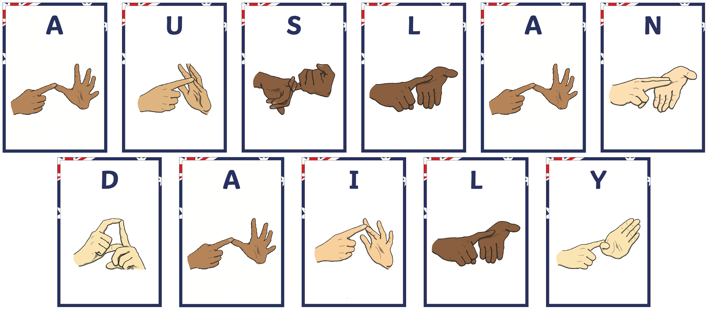

<!--
<head>
    
</head>
<figure class="image-with-caption">
    
    <!-- <figcaption>Spatial Annotation</figcaption> -->
<!-- </figure> -->

**Sign Language (SL)** is the primary mode of communication for deaf or hearing-impaired individuals.
Each sign language possesses its own vocabulary and grammatical rules, akin to spoken languages.
Notably, even within regions that share a commonly spoken language, such as the United States, Australia, and the United Kingdom, distinct native sign languages are prevalent.
To facilitate communication between the deaf and hearing communities, Isolated Sign Language Recognition (ISLR) is highlighted as a fundamental sign language understanding task.
ISLR aims to recognize an individual sign gloss, which is a written representation of signs using words from a spoken language, into a corresponding word or phrase in spoken languages.

With emerging deep learning techniques and large-scale sign language datasets, ISLR achieves promising progress recently.
Researchers from various countries construct word-level sign language datasets and thus promote the development of ISLR in the respective sign languages, such as American sign language (ASL), British sign language (BSL), Chinese sign language (CSL) and German sign language (DGS).

**Auslan** is the sign language used by the majority of the Australian Deaf community. The term Auslan is a portmanteau of “Australian Sign Language”, coined by Trevor Johnston in the 1980s, although the language itself is much older. Auslan is related to British Sign Language (BSL) and New Zealand Sign Language (NZSL); the three have descended from the same parent language, and together comprise the BANZSL language family. Auslan has also been influenced by Irish Sign Language (ISL) and more recently has borrowed signs from American Sign Language (ASL). As with other sign languages, Auslan’s grammar and vocabulary is quite different from English. Its origin cannot be attributed to any individual; rather, it is a natural language that emerged spontaneously and has changed over time.
Meanwhile, according to the Australian Federal Department of Health and Aged Care ([DHAC](https://www.health.gov.au/topics/ear-health/about)), as of 14 May 2024, one in six Australians, over 3.6 million people, had hearing loss affecting them, and the number is expected to increase to 7.8 million people by 2060.
However, to the best of our knowledge, there is no publicly available large-scale Auslan dataset for ISLR.
Due to the regional nature of sign languages and the societal commitment to supporting individuals with hearing impairments, word-level Australian Sign Language (Auslan) datasets are inevitably and urgently needed in order to investigate automatic recognition.

**MM-WLAuslan** is the first large-scale Auslan isolated sign language recognition dataset. It has three features (1) **<u>the largest amount</u>** of data, (2) **<u>the most extensive</u>** vocabulary, and (3) **<u>the most diverse</u>** of multi-modal camera views.
Our releasing this dataset will help bridge that gap and provide necessary data resources for creating more equitable and inclusive AI systems. In the rapidly advancing era of AI, it is of paramount importance to ensure that the needs and inclusion of the Australian deaf community are not overlooked.
