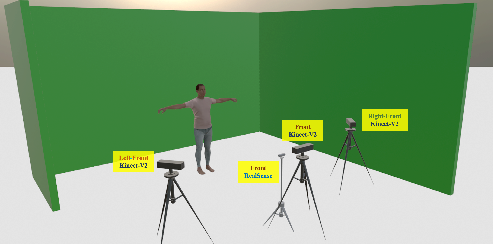

<head>
    
</head>

## Recording Setup and Workflow

Our recording setup is located in a studio environment surrounded by a green screen.
In the studio, we position **Kinect-V2** cameras at the left-front, front, and right-front views, along with a centrally placed **RealSense** camera.

 
<figure class="image-with-caption">
    
    <figcaption>Schematic diagram of our recording studio.</figcaption>
</figure>
 
Both Kinect-V2 and RealSense are capable of recording high-quality videos with depth information.
Most importantly, the imaging principles of Kinect-V2 and RealSense cameras are different.
The former employs time-of-flight technology to measure depth, while the latter utilizes stereo vision to capture depth information.
Moreover, Kinect-V2 offers high resolution and excellent depth sensing, while RealSense provides a higher frame rate and portability.
We record data using these two types of RGB-D cameras to investigate the cross-camera robustness of methods.
We recruit signers with diverse experience in Auslan, including Auslan experts, deaf individuals who use Auslan, and volunteers interested in sign language, to sign glosses.
The involvement of Auslan experts and deaf individuals ensures the precision of a subset of the data, which is crucial for precise research and applications of sign language.
The extensive participation of volunteers enhances the diversity of the signers, reflecting the natural variability in the deaf community.
Meanwhile, we raise awareness about the deaf community, advocating for greater support for this marginalized group.
We record videos of sign language imitated by volunteers. Each sign is supervised and checked by at least one expert to ensure the precision of the sign language expression.
 

## Data Processing and Augmentation

After recording all the sign language videos, we notice that a significant portion of the footage consists of a green screen background.
We crop videos based on a fixed-size box that can cover every signer and align their eyes on the same horizontal level.

To evaluate the performance of ISLR systems under real-world scenarios, we provide a diverse test set with four distinct subsets, including studio (STU) set, in-the-wild (ITW) set, synthetic background (SYN) set, and temporal disturbance (TED) set. Each subset encompasses videos for all gloss vocabulary.
The **STU set** includes consistent scene settings with the training set.
In the **ITW set**, green screens are removed and replaced with dynamic or static backgrounds to simulate videos recorded in diverse environments, as shown in following Figure.
We utilize the [Background Remover](https://github.com/nadermx/backgroundremover) to extract signers from videos and synthesize indoor and outdoor backgrounds in the **SYN set**.
The **TED set** simulates potential recording time discrepancies in real-world scenarios by randomly adjusting video segments through removal or altering playback speed.

 
<figure class="image-with-caption">
    
    <figcaption> Demonstrations of test subsets. "STU", "ITW", "SYN", and "TED" represent the studio set, in-the-wild set, synthetic background set and temporal disturbance set, respectively.</figcaption>
</figure>
