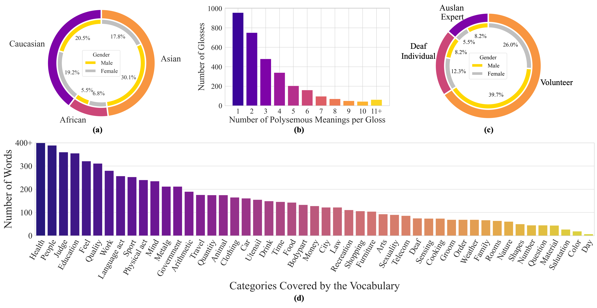
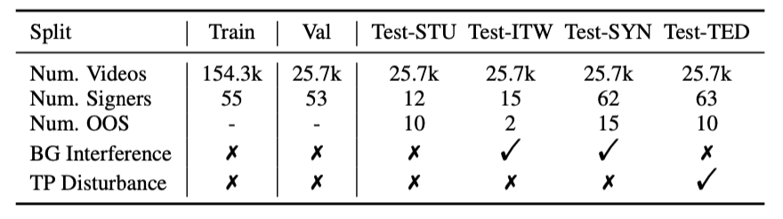

<head>
    
</head>

## Data Statistics of MM-WLAuslan

<figure class="image-with-caption">
    
    <figcaption>Statistics of signers and glosses. (a) Ethnicity and gender distribution. (b) Frequency of polysemous glosses.  (c) Distribution of Auslan proficiency. (d) Categories of words.</figcaption>
</figure>
 

We select 3,215 commonly used Auslan glosses, corresponding to over 7,900 English words or phrases.
As illustrated in above figure, there are more than 2,000 glosses with multiple meanings, highlighting the contextual variability of sign language similar to natural languages.
Additionally, these terms are finely categorized into 49 groups, including health, education, and others, as shown in above figure(d).
The extensive vocabulary and semantic richness of MM-WLAuslan demonstrate its potential to advance sign language research and applications.

After over 2,500 hours of recording, we capture 282,900 videos by 73 signers.
Specifically, for 3,215 commonly used word-level Auslan glosses, we record every gloss 22 times utilizing 4 different cameras (3215×20×4).
Unlike other datasets, our dataset maintains a consistent number of videos per Auslan gloss, thereby establishing a uniform ISLR dataset.
We split the samples of a gloss into training, validation, and testing sets following a ratio of 6:1:4.

 
<figure class="image-with-caption">
    
    <figcaption>Key statistics of MM-WLAuslan dataset splits. "BG" and "TP" represent background and temporal, respectively.  "OOS" indicates the signers only occur in the test set.</figcaption>
</figure>
 

Note that the test set contains 18 signers who do not appear in either the training or validation sets.
Additionally, we further divide the testing set into the STU set, the ITW set, the SYN set, and the TED set in a 1:1:1:1 ratio.
The detailed split statistics are demonstrated in above table.

Moreover, as illustrated in above figure(a), we provide the ethnic and gender distribution of signers in MM-WLAuslan. The signers are categorized into three primary ethnic groups: Caucasian, African, and Asian. The male-to-female ratios are relatively balanced across the different ethnic groups.
The near-equitable gender balance within each ethnic group not only enhances the representativeness of the dataset but also underscores its gender fairness.
Meanwhile, we include a broader range of ethnicities to enhance the inclusivity and representativeness of the dataset further. Thus, this composition ensures that the ISLR models developed from this dataset mitigate biases and offer equitable performance across the diverse Australian population.
Furthermore, we demonstrate the distribution of participants involved in recording, segmented by their proficiency in Auslan. We make concerted efforts to include as many Auslan experts and deaf individuals as possible for the quality of the recordings. Additionally, we recruit many volunteers to further increase the diversity of the singers, and thus, enrich the representativeness of the dataset.
