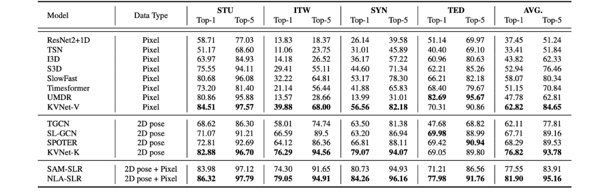
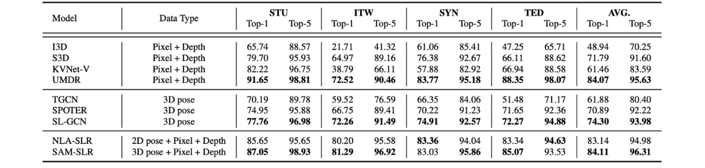
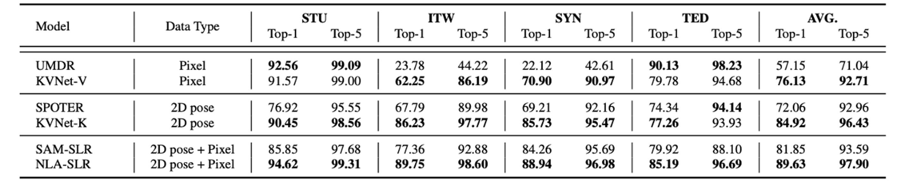
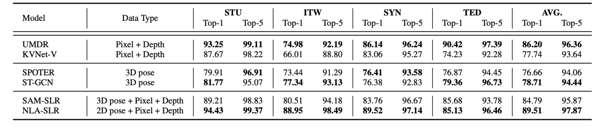

<head>
    
</head>

## In-Domain Isolated Sign Language Recognition Setting

**Single-view RGB-based ISLR** involves recognizing isolated sign language from video sequences captured from a single fixed camera.

<figure class="image-with-caption">
    
    <figcaption>The baseline of Single-view RGB-based ISLR on MM-WLAuslan.</figcaption>
</figure>
 

**Single-view RGB-D-based ISLR** aims to enhance the recognition of isolated signs by incorporating depth information along with RGB data.

<figure class="image-with-caption">
    
    <figcaption>The baseline of Single-view RGB-D-based ISLR on MM-WLAuslan.</figcaption>
</figure>
 

**Multi-view RGB-based ISLR** employs multiple cameras to capture the sign language videos.

<figure class="image-with-caption">
    
    <figcaption>The baseline of Multi-view RGB-based ISLR on MM-WLAuslan.</figcaption>
</figure>
 

**Multi-view RGB-D-based ISLR** incorporates depth data in a multi-view setup.

<figure class="image-with-caption">
    
    <figcaption>The baseline of Multi-view RGB-D-based ISLR on MM-WLAuslan.</figcaption>
</figure>
 

### Baseline Models

We mention that all models used in this work are publicly available. We express profound gratitude to the aforementioned authors for their invaluable contributions. Each of the ISLR models we use is linked below:

- **RGB-based & RGB-D-based model:**
  - ResNet2+1D [GitHub](https://github.com/leftthomas/R2Plus1D-C3D)
  - TSN [GitHub](https://github.com/yjxiong/temporal-segment-networks)
  - I3D [GitHub](https://github.com/google-deepmind/kinetics-i3d)
  - S3D [GitHub](https://github.com/kylemin/S3D)
  - SlowFast [GitHub](https://github.com/facebookresearch/SlowFast)
  - Timesformer [GitHub](https://github.com/facebookresearch/TimeSformer)
  - UMDR [GitHub](https://github.com/damo-cv/MotionRGBD)
  - KVNet-V [GitHub](https://github.com/FangyunWei/SLRT)

- **2D pose-based & 3D pose-based model:**
  - TGCN [GitHub](https://github.com/dxli94/WLASL)
  - SL-GCN [GitHub](https://github.com/jackyjsy/SAM-SLR-v2)
  - SPTOTER [GitHub](https://github.com/matyasbohacek/spoter)
  - KVNet-K [GitHub](https://github.com/FangyunWei/SLRT)

- **Multi-modal-based model:**
  - SAM-SLR [GitHub](https://github.com/jackyjsy/SAM-SLR-v2)
  - NLA-SLR [GitHub](https://github.com/FangyunWei/SLRT)

