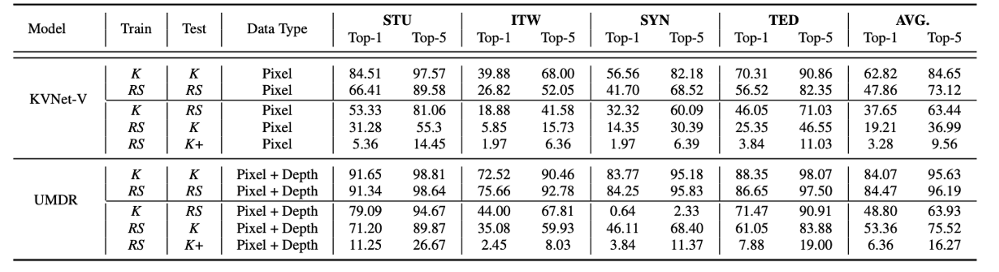

<head>
    
</head>

## Cross-Domain Isolated Sign Language Recognition Setting

**Cross-Camera ISLR** aims to test the robustness of the model against variations in camera specifications and settings. Training and testing data are captured from different cameras. It is challenging for the model to generalize across hardware-induced discrepancies.

<figure class="image-with-caption">
    
    <figcaption>The baseline of Cross-Camera ISLR on MM-WLAuslan.</figcaption>
</figure>
 

**Cross-View ISLR** requires the model to recognize signs from views not seen during training. With training views denoted as $V_{\text{train}}$ and testing views as $V_{\text{test}}$, the model must handle the appearance changes due to different viewing angles, thus testing its view-invariance capabilities.

<figure class="image-with-caption">
    
    <figcaption>The baseline of Cross-view ISLR on MM-WLAuslan.</figcaption>
</figure>
 
