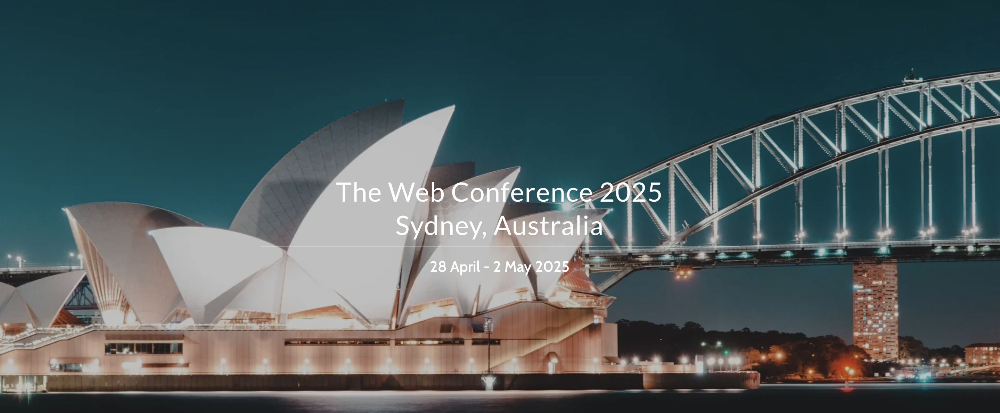

<!--
<head>
    
</head>
<figure class="image-with-caption">
    
    <!-- <figcaption>Spatial Annotation</figcaption> -->
<!-- </figure> -->

## Invitation to Join the CV-ISLR Challenge

We are excited to invite you to participate in our **Cross-View Isolated Sign Language Recognition Challenge (CV-ISLR)**, hosted as part of **The Web Conference**.

 

### Date
- **Event**: Cross-View Isolated Sign Language Recognition Challenge
- **Host**: The Web Conference & The University of Queensland
- **Timeline**:
  - **Challenge End Date**: 24 December, 2024
  - **Workshop Paper Submission**: 25 December, 2024
  - **Workshop Paper Notification**: 13 January, 2025
  - **Workshop Paper Camera-Ready**: 2 February, 2025
  - **Workshops**: 28 April - 29 April, 2025

All submission deadlines are end-of-day in the *Anywhere on Earth (AoE)* time zone.

 

### News
**Dec. 6th:** We have updated CodaLab for registration and result submission. Please refer to "**How to Participate**".

 
 

### About the CV-ISLR Challenge
This challenge focuses on advancing the field of sign language recognition by addressing the unique complexities of cross-view scenarios. Participants will have the opportunity to push the boundaries of machine learning and computer vision while contributing to the inclusivity and accessibility of technology.

Cross-View Isolated Sign Language Recognition (CV-ISLR) aims to tackle a significant issue in the current field of isolated sign language recognition (ISLR). Most commonly used datasets for ISLR capture sign language videos from a frontal view. However, in real-life situations, it is not always feasible to ensure the camera is positioned directly in front of the signer. As a result, recognition models need to be capable of understanding sign language from various viewpoints, making cross-view ISLR a critical challenge.

To address this, we have curated the [**MM-WLAuslan**](https://arxiv.org/pdf/2410.19488) dataset, which was specifically recorded with cross-view recognition in mind. MM-WLAuslan is **the first** large-scale Multi-view Multi-modal Word-Level Australian Sign Language recognition dataset. We recorded **282K+** sign videos covering **3,215** commonly used Auslan glosses presented by **73** signers in a studio environment. Our filming system includes two different types of cameras, i.e., three Kinect-V2 cameras and a RealSense camera. Cameras were positioned hemispherically around the front half of the signer, and all four cameras simultaneously recorded videos.

As shown in the accompanying figures, different camera angles were utilized to reflect the diversity of potential viewpoints encountered outside controlled environments.

During testing, we further simulate real-life scenarios by setting different test conditions to evaluate model performance across various views. We provide a diverse test set with four distinct subsets, including:
1. **Studio (STU) set**: Consistent scene settings with the training set.
2. **In-the-wild (ITW) set**: Dynamic or static backgrounds replace the green screens to simulate videos recorded in diverse environments.
3. **Synthetic background (SYN) set**: A background remover extracts signers from videos, and indoor or outdoor backgrounds are synthesized.
4. **Temporal disturbance (TED) set**: This set simulates potential recording time discrepancies in real-world scenarios by randomly adjusting video segments through removal or altering playback speed.

Please see more data sample details [here](https://uq-cvlab.github.io/MM-WLAuslan-Dataset/docs/en/dataset-source).

 

### Challenge Details

To encourage research in this area, we are launching the Cross-View Isolated Sign Language Recognition Challenge, which will feature two competition settings:
1. **RGB-based ISLR**: Participants will develop models using only the front Kinect-V2 RGB data from the dataset, aiming to recognize signs from different views (left-front and right-front Kinect-V2) based on pixel information alone.
2. **RGB-D-based ISLR**: Participants will have access to both RGB and depth data, allowing them to leverage multi-modal information to improve recognition performance across views.

We will use **Top-1 Accuracy** to evaluate participants' ISLR models.

 

### Dataset Download

We have divided the dataset into three subsets: Train, Valid, and Test.

- **Train and Valid**: These subsets provide RGB and depth data from the front view, along with the corresponding gloss annotations.
- **Test**: This subset only includes RGB and depth data from the left and right views, without annotations.

 

The download links for each subset **(Click to enter Google Drive)**:
  - [Train and Valid Labels](https://drive.google.com/drive/folders/1fa7tu7PfNl8JVLkRa5pUAzR7uMtVkGkk?usp=drive_link) (Please note that the **base names of the videos** are used in the labels. To correctly map the labels to the corresponding videos, make sure to read the [ReadMe.ipynb](https://drive.google.com/drive/folders/1pxOnL7IaT42hyp4E9zXqeMRvpkByAJZm?usp=drive_link) file included in the dataset.)
  - [Train Set](https://drive.google.com/drive/folders/1z2LiXBWwQOHEYKN4GbFBnWzF4LOAs8Lk?usp=drive_link)
  - [Valid Set](https://drive.google.com/drive/folders/1AyAhxsiempMq-272irtDbbTMmBHpKvSc?usp=drive_link)
  - [Test Set](https://drive.google.com/drive/folders/1meTX_yNDWJd0eJTNcCCvMzqvISqUWTT4?usp=drive_link) and [Test Order](https://drive.google.com/file/d/1Yp411X8_vByWSt_KdDT4ovGis2RSQFGr/view?usp=drive_link)

 

### Why Participate?
- **Exciting Research Opportunities**: Tackle a cutting-edge problem in sign language recognition.
- **Global Exposure**: Showcase your work at The Web Conference, a premier international venue for researchers and practitioners.
- **Generous Awards**: The top three entries in each setting, or innovative works, will be featured at **The Web Conference**.
- **Collaborative Community**: Engage with fellow researchers and practitioners passionate about creating impactful solutions.

 

### How to Participate
1. Visit our challenge page: [RGB](https://codalab.lisn.upsaclay.fr/competitions/21021) and [RGB-D](https://codalab.lisn.upsaclay.fr/competitions/21025)
2. Register your team.
3. Download the **Test Set** video and **Test Order** file.
4. Perform inference according to the **Test Order** file, save the results in **"answer.txt"**, and then zip it as **"answer.zip"** to submit the result. Here is an [example](https://drive.google.com/file/d/19m9hawCCUWcp7Ezzv-lWlzU3M9iVFrb2/view?usp=drive_link)
5. Submit your solutions before the deadline.

Note: The use of any open-source additional data and pre-trained models is allowed. However, please note that the MM-WLAuslan dataset is fully open-source, and participants are not permitted to use other perspectives of MM-WLAuslan for training. When submitting your paper, please also provide the processed data, code, and detailed training procedures. We will attempt to reproduce your results, and the ranking will be determined based on the novelty of the paper and the reproducibility of the results.

 
### Paper Submission Guidelines
Paper submission guidelines can be found [here](https://www2025.thewebconf.org/workshops).
 

Submission Site [Coming Soon]

  

Whether you're a researcher, student, or enthusiast, your participation will contribute to advancing sign language recognition and fostering a more inclusive technological future.  We look forward to seeing your innovative solutions!

**If you have any questions, please feel free to contact Xin Shen (x.shen3@uqconnect.edu.au) and Heming Du (heming.du@uq.edu.au)**.

### Reference
Please cite the MM-WLAuslan paper:

      @article{shen2024mm,
        title={MM-WLAuslan: Multi-View Multi-Modal Word-Level Australian Sign Language Recognition Dataset},
        author={Shen, Xin and Du, Heming and Sheng, Hongwei and Wang, Shuyun and Chen, Hui and Chen, Huiqiang and Wu, Zhuojie and Du, Xiaobiao and Ying, Jiaying and Lu, Ruihan and others},
        journal={arXiv preprint arXiv:2410.19488},
        year={2024}
      }

Please consider citing our work about ISLR and Auslan:

     @inproceedings{li2020word,
        title={Word-level Deep Sign Language Recognition from Video: A New Large-scale Dataset and Methods Comparison},
        author={Li, Dongxu and Rodriguez, Cristian and Yu, Xin and Li, Hongdong},
        booktitle={The IEEE Winter Conference on Applications of Computer Vision},
        pages={1459--1469},
        year={2020}
     }

      @inproceedings{ShenYSDY23,
        title        = {Auslan-Daily: Australian Sign Language Translation for Daily Communication and News},
        author       = {Xin Shen and Shaozu Yuan and Hongwei Sheng and Heming Du and Xin Yu},
        booktitle    = {Advances in Neural Information Processing Systems 36: Annual Conference on Neural Information Processing Systems 2023, NeurIPS 2023, New Orleans, LA, USA, December 10 - 16, 2023},
        year         = {2023}
      }

